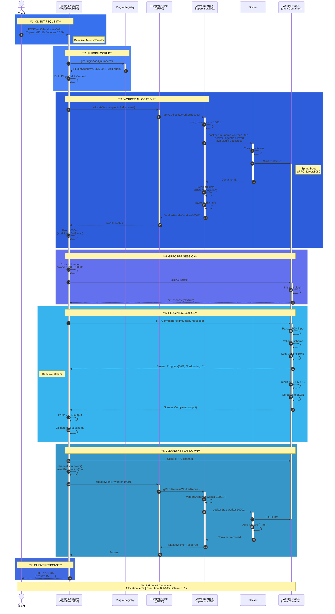
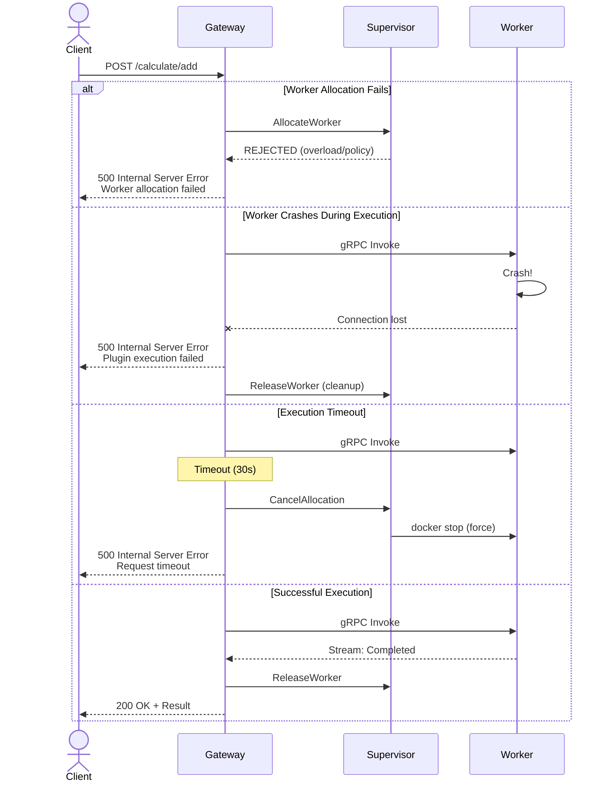
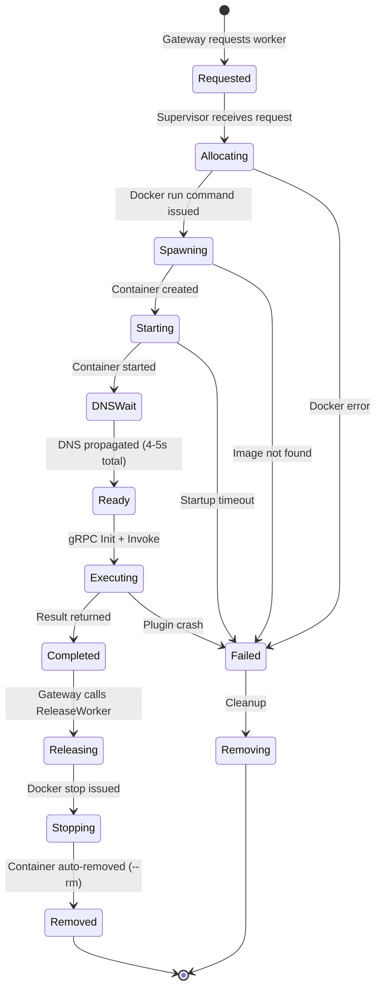
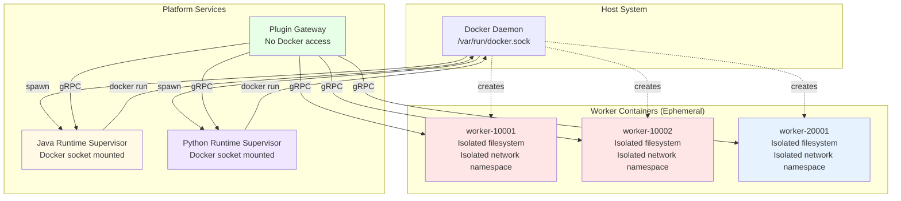

# API Flow Sequence Diagrams

## Add Plugin API Flow (Java Worker)



## Subtract Plugin API Flow (Python Worker)

```mermaid
sequenceDiagram
    autonumber
    actor Client
    participant GW as Plugin Gateway<br/>(WebFlux:8080)
    participant REG as Plugin Registry
    participant RSC as Runtime Client<br/>(gRPC)
    participant PRS as Python Runtime<br/>Supervisor:9092
    participant Docker
    participant Worker as worker-20001<br/>(Python Container)
    
    %% Request Initiation
    rect rgb(55, 113, 238)
    Note over Client,GW: **1. CLIENT REQUEST (REACTIVE)**
    Client->>+GW: POST /api/v1/calculate/subtract<br/>{"operand1": 10, "operand2": 5}
    Note right of GW: Mono.fromCallable()<br/>subscribeOn(boundedElastic)
    end
    
    %% Plugin Lookup
    rect rgb(75, 133, 248)
    Note over GW,REG: **2. PLUGIN LOOKUP**
    GW->>+REG: getPlugin("subtract_numbers")
    REG-->>-GW: PluginSpec(python, PRS:9092,<br/>subtract_plugin.py)
    GW->>GW: Build PluginRef & Context<br/>(tenant, user, session, request IDs)
    end
    
    %% Worker Allocation
    rect rgb(45, 93, 218)
    Note over GW,PRS: **3. WORKER ALLOCATION (PYTHON)**
    GW->>+RSC: allocateWorker(pluginRef, context)
    RSC->>+PRS: gRPC AllocateWorkerRequest
    Note right of PRS: Python gRPC server<br/>grpc.server()
    
    PRS->>PRS: port_counter++ → 20001
    PRS->>+Docker: subprocess.run([<br/>  "docker", "run",<br/>  "--name", "worker-20001",<br/>  "--network", "agentic-...",<br/>  "python-plugin-subtract:latest"<br/>])
    Docker->>Docker: Create Python container
    Docker->>+Worker: Start container
    Note right of Worker: Python 3.11<br/>gRPC Server:8080<br/>subtract_plugin.py
    Docker-->>-PRS: Container ID
    
    PRS->>PRS: time.sleep(4)<br/>(Container + DNS)
    PRS->>PRS: workers[worker-20001] = WorkerProcess
    PRS-->>-RSC: WorkerHandle(worker-20001, python)
    RSC-->>-GW: worker-20001
    
    GW->>GW: Thread.sleep(1000)<br/>(DNS propagation)
    end
    
    %% gRPC Communication
    rect rgb(100, 113, 238)
    Note over GW,Worker: **4. GRPC PPP PROTOCOL**
    GW->>GW: ManagedChannel<br/>.forTarget("worker-20001:8080")
    GW->>+Worker: gRPC Init(ctx)
    Worker->>Worker: Load subtract_plugin.py
    Worker->>Worker: Initialize gRPC servicer
    Worker-->>-GW: InitResponse(ok=True,<br/>message="Subtract plugin ready")
    end
    
    %% Plugin Execution
    rect rgb(55, 180, 238)
    Note over GW,Worker: **5. PLUGIN EXECUTION**
    GW->>+Worker: gRPC Invoke(STREAMING)<br/>InvokeRequest {<br/>  primitive: "subtract_numbers",<br/>  arguments: ByteString(JSON),<br/>  request_id: UUID<br/>}
    
    Worker->>Worker: json.loads(json_str)
    Worker->>Worker: operand1 = 10.0<br/>operand2 = 5.0
    Worker->>Worker: Log: "Subtracting..."
    
    Worker-->>GW: Stream 1: PluginMessage {<br/>  progress: {<br/>    percent: 50.0,<br/>    message: "Performing..."<br/>  }<br/>}
    
    Worker->>Worker: result = 10.0 - 5.0
    Worker->>Worker: result = 5.0
    Worker->>Worker: Build response dict
    Worker->>Worker: json.dumps(response)
    
    Worker-->>-GW: Stream 2: PluginMessage {<br/>  completed: {<br/>    output: ByteString({<br/>      "result": 5.0,<br/>      "operation": "subtract",<br/>      ...<br/>    })<br/>  }<br/>}
    
    GW->>GW: Parse ByteString to JSON
    GW->>GW: Deserialize to CalculationResult
    end
    
    %% Cleanup
    rect rgb(55, 150, 200)
    Note over GW,Worker: **6. TEARDOWN & CLEANUP**
    GW->>Worker: Close channel
    GW->>GW: channel.shutdown()
    
    GW->>+RSC: releaseWorker(worker-20001,<br/>"execution_complete")
    RSC->>+PRS: gRPC ReleaseWorkerRequest
    PRS->>PRS: workers.pop("worker-20001")
    
    PRS->>+Docker: subprocess.run([<br/>  "docker", "stop",<br/>  "worker-20001"<br/>])
    Docker->>Worker: SIGTERM
    deactivate Worker
    Note right of Worker: Container stops<br/>--rm auto-removes
    Docker->>Docker: Remove container<br/>Free resources
    Docker-->>-PRS: Exit 0
    
    PRS-->>-RSC: ReleaseWorkerResponse
    RSC-->>-GW: Success
    end
    
    %% Response
    rect rgb(65, 105, 225)
    Note over Client,GW: **7. REACTIVE RESPONSE**
    GW->>GW: Mono publishes result
    GW-->>-Client: HTTP 200 OK<br/>{"result": 5.0,<br/> "operation": "subtract",<br/> "operand1": 10.0,<br/> "operand2": 5.0}
    end
    
    Note over Client,Docker: Timing Breakdown:<br/>Worker Spawn: 4s | DNS Wait: 1s | Execute: 0.1s | Cleanup: 1s<br/>Total: ~6 seconds (ephemeral mode)
```



## Key Differences: Java vs Python Workers

| Aspect | Add (Java) | Subtract (Python) |
|--------|------------|-------------------|
| **Runtime Supervisor** | Java Runtime (JRS:9091) | Python Runtime (PRS:9092) |
| **Worker Image** | `java-plugin-add:latest` | `python-plugin-subtract:latest` |
| **Container Tech** | Spring Boot + gRPC | Python 3.11 + gRPC |
| **Worker ID Format** | `worker-100XX` | `worker-200XX` |
| **Port Range** | 10000-10100 | 20000-20100 |
| **Base Image** | eclipse-temurin:17-jre (320MB) | python:3.11-slim (221MB) |
| **Startup Time** | ~3-4 seconds | ~2-3 seconds |
| **Memory Usage** | ~100MB | ~50MB |
| **gRPC Server** | Java gRPC (netty) | Python gRPC |
| **PPP Implementation** | AddPluginService.java | subtract_plugin.py |

## Protocol Stack Layers

```
┌─────────────────────────────────────────────────┐
│  Layer 1: Client HTTP/REST                      │
│  - POST /api/v1/calculate/{operation}           │
│  - Content-Type: application/json                │
└─────────────────┬───────────────────────────────┘
                  │
┌─────────────────▼───────────────────────────────┐
│  Layer 2: Plugin Gateway (Spring WebFlux)       │
│  - Reactive Mono<CalculationResult>             │
│  - Netty web server (non-blocking)              │
│  - Reactor: Mono.fromCallable()                 │
└─────────────────┬───────────────────────────────┘
                  │
┌─────────────────▼───────────────────────────────┐
│  Layer 3: Runtime Supervisor API (gRPC)         │
│  - AllocateWorker / ReleaseWorker               │
│  - Protocol: runtime_supervisor.proto           │
│  - Transport: gRPC over TCP                     │
└─────────────────┬───────────────────────────────┘
                  │
┌─────────────────▼───────────────────────────────┐
│  Layer 4: Docker Container Management           │
│  - docker run / docker stop                     │
│  - Container lifecycle                          │
│  - Network: agentic-server-platform-poc_...     │
└─────────────────┬───────────────────────────────┘
                  │
┌─────────────────▼───────────────────────────────┐
│  Layer 5: Platform-Plugin Protocol (gRPC/PPP)   │
│  - Init / Invoke / Health                       │
│  - Protocol: plugin_protocol.proto              │
│  - Streaming: Progress, ResultChunk, Completed  │
└─────────────────┬───────────────────────────────┘
                  │
┌─────────────────▼───────────────────────────────┐
│  Layer 6: Plugin Worker                         │
│  - Java: AddPluginService / MultiplyPluginService │
│  - Python: subtract_plugin.py                   │
│  - Business logic execution                     │
└─────────────────────────────────────────────────┘
```

## Reactive Flow Characteristics

### WebFlux Reactive Execution

The Plugin Gateway uses **Spring WebFlux** with **Project Reactor**:

```java
// Controller (Reactive)
@PostMapping("/add")
public Mono<CalculationResult> add(@RequestBody CalculationRequest request) {
    return executionService.executeCalculation("add_numbers", request)
            .doOnError(e -> log.error("Error", e));
}

// Service (Wraps blocking in reactive)
public Mono<CalculationResult> executeCalculation(String op, CalculationRequest req) {
    return Mono.fromCallable(() -> executeCalculationBlocking(op, req))
            .subscribeOn(Schedulers.boundedElastic());
}
```

**Benefits**:
- ⚡ Non-blocking I/O - doesn't tie up threads during worker spawn
- 🔄 Backpressure support - natural flow control
- 📊 Better scalability - handle more concurrent requests
- 🎯 Composable - easy to chain operations

**Current State**: Partially reactive (gRPC calls wrapped in Mono)  
**Future Enhancement**: Fully reactive gRPC using reactive stubs

## Timing Analysis

### Ephemeral Worker Mode (Current Implementation)

| Phase | Java Worker | Python Worker | Details |
|-------|-------------|---------------|---------|
| **1. Worker Spawn** | 4s | 4s | Docker container creation + Spring/Python boot |
| **2. DNS Propagation** | 1s | 1s | Docker network DNS registration |
| **3. gRPC Init** | 20ms | 15ms | PPP initialization handshake |
| **4. Execution** | 80ms | 60ms | Actual calculation + JSON serialization |
| **5. Channel Close** | 100ms | 100ms | Graceful gRPC shutdown |
| **6. Container Stop** | 500ms | 400ms | SIGTERM + container removal |
| **TOTAL** | ~5.7s | ~5.6s | End-to-end request time |

### GraalVM Native Mode (Future)

| Phase | Java Worker (Native) | Improvement |
|-------|----------------------|-------------|
| **1. Worker Spawn** | 0.5s | **8x faster** |
| **2. DNS Propagation** | 1s | Same |
| **3. gRPC Init** | 10ms | **2x faster** |
| **4. Execution** | 60ms | **1.3x faster** |
| **5. Channel Close** | 100ms | Same |
| **6. Container Stop** | 300ms | **1.7x faster** |
| **TOTAL** | ~2s | **2.8x faster** |

### Worker Pooling Mode (Future Enhancement)

| Phase | Warm Worker | Improvement |
|-------|-------------|-------------|
| **1. Worker Spawn** | 0ms | Already running |
| **2. DNS Propagation** | 0ms | Already registered |
| **3. gRPC Init** | 5ms | Cached connection |
| **4. Execution** | 60ms | Same |
| **5. Channel Close** | 5ms | Keep-alive |
| **6. Container Stop** | 0ms | Returned to pool |
| **TOTAL** | ~70ms | **80x faster** |

## Error Handling Flow



## Component Communication Matrix

| From → To | Protocol | Transport | Purpose |
|-----------|----------|-----------|---------|
| Client → Gateway | HTTP REST | TCP:8080 | Submit calculation request |
| Gateway → Registry | Java Method | In-process | Lookup plugin spec |
| Gateway → JRS | gRPC | TCP:9091 | Allocate/Release Java workers |
| Gateway → PRS | gRPC | TCP:9092 | Allocate/Release Python workers |
| JRS → Docker | CLI/Socket | Unix socket | Spawn/Stop Java containers |
| PRS → Docker | CLI/Socket | Unix socket | Spawn/Stop Python containers |
| Gateway → Worker | gRPC (PPP) | Docker network | Plugin execution (Init/Invoke) |

## State Management

### Worker Lifecycle States



## Network Architecture

```
┌─────────────────────────────────────────────────────────┐
│  Docker Network: agentic-server-platform-poc_agentic-network │
│                                                         │
│  ┌──────────────┐   ┌──────────────┐   ┌───────────┐  │
│  │ plugin-      │   │ java-runtime-│   │  python-  │  │
│  │ gateway      │   │ supervisor   │   │  runtime- │  │
│  │ :8080        │   │ :9091        │   │  super    │  │
│  └──────┬───────┘   └──────┬───────┘   │  visor    │  │
│         │                  │            │  :9092    │  │
│         │                  │            └─────┬─────┘  │
│         │                  │                  │        │
│         │    ┌─────────────▼──────┐    ┌──────▼─────┐ │
│         └────►worker-10001:8080   │    │worker-20001│ │
│              │(java-plugin-add)   │    │:8080       │ │
│              └────────────────────┘    │(python-    │ │
│                                        │subtract)   │ │
│              ┌────────────────────┐    └────────────┘ │
│         └────►worker-10002:8080   │                   │
│              │(java-plugin-mult)  │                   │
│              └────────────────────┘                   │
│                                                        │
│  DNS Resolution: Container names resolve to IPs       │
│  No external port mapping for workers (internal only) │
└────────────────────────────────────────────────────────┘
         ▲
         │ Host port mapping
         │ 8080 → gateway:8080
         │ 9091 → java-runtime:9091
         │ 9092 → python-runtime:9092
```

## Isolation & Security Model



**Isolation Guarantees**:
- ✅ Each worker in separate container (hard boundary)
- ✅ No shared memory between workers
- ✅ Independent crash domains
- ✅ Network isolated (custom network)
- ✅ Auto-cleanup on exit (--rm flag)
- ✅ Gateway has no Docker access (privilege separation)


