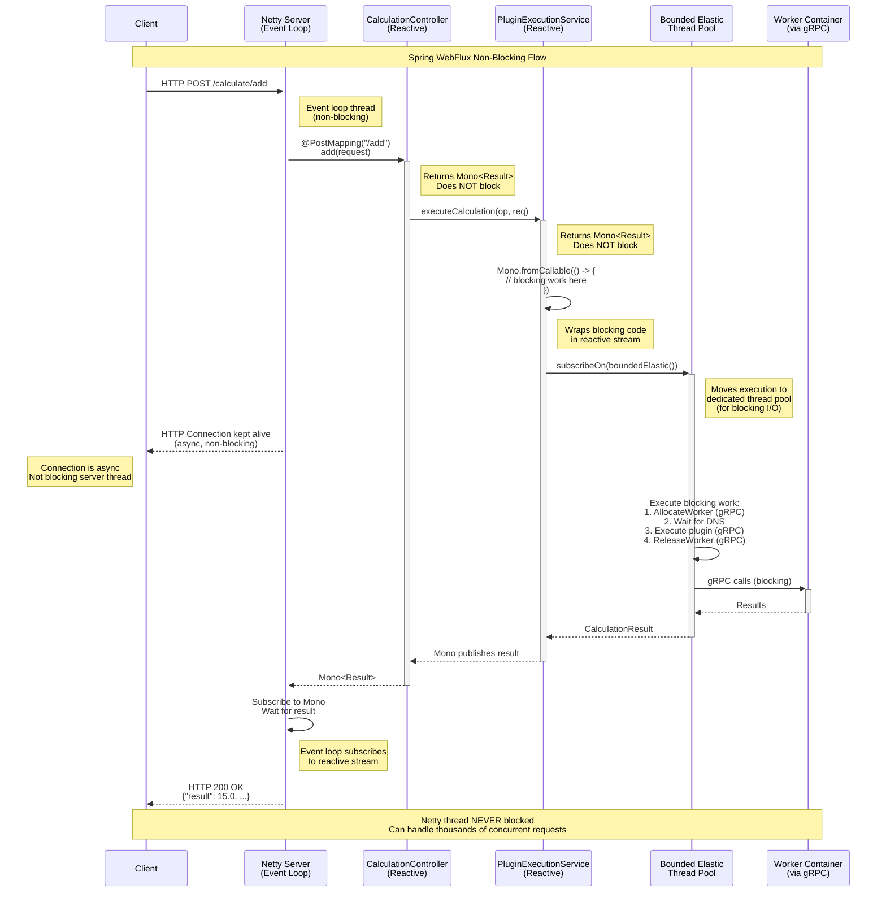

# Spring WebFlux Reactive Flow

## Overview

This document explains how Spring WebFlux's reactive patterns are used in the Plugin Gateway to handle non-blocking I/O during long-running worker operations.

## Reactive Request Flow



## Blocking vs Reactive Comparison

### Before: Spring MVC (Blocking)

```java
@RestController
public class CalculationController {
    
    @PostMapping("/add")
    public ResponseEntity<CalculationResult> add(@RequestBody CalculationRequest request) {
        // BLOCKING - Thread tied up for 5-7 seconds!
        CalculationResult result = service.executeCalculation("add", request);
        return ResponseEntity.ok(result);
    }
}
```

**Problem**:
- One thread per request
- Thread blocks for 5-7 seconds waiting for worker
- With 200 concurrent requests = 200 threads needed
- Thread pool exhaustion under load

### After: Spring WebFlux (Reactive)

```java
@RestController
public class CalculationController {
    
    @PostMapping("/add")
    public Mono<CalculationResult> add(@RequestBody CalculationRequest request) {
        // NON-BLOCKING - Returns immediately!
        return service.executeCalculation("add", request)
                .doOnError(e -> log.error("Error", e));
    }
}
```

**Benefits**:
- Netty event loop threads never block
- With 200 concurrent requests = ~10 event loop threads
- Blocking work offloaded to `boundedElastic()` scheduler
- Better resource utilization

## Reactive Service Implementation

```java
@Service
public class PluginExecutionService {
    
    // Returns Mono - reactive stream
    public Mono<CalculationResult> executeCalculation(String op, CalculationRequest req) {
        // Wrap blocking gRPC calls in reactive container
        return Mono.fromCallable(() -> executeCalculationBlocking(op, req))
                .subscribeOn(Schedulers.boundedElastic());
                //          ^^^^^^^^^^^^^^^^^^^^^^^^^^^^^^
                //          Executes on separate thread pool
                //          designed for blocking I/O
    }
    
    // Actual blocking implementation
    private CalculationResult executeCalculationBlocking(String op, CalculationRequest req) 
            throws Exception {
        // This runs on boundedElastic thread pool, not event loop
        
        // 1. Allocate worker (gRPC - blocks for 4-5s)
        AllocateWorkerResponse response = runtimeClient.allocateWorker(...);
        
        // 2. Wait for DNS
        Thread.sleep(1000);
        
        // 3. Execute plugin (gRPC - blocks for ~0.1s)
        CalculationResult result = executePlugin(...);
        
        // 4. Release worker (gRPC - blocks for ~1s)
        runtimeClient.releaseWorker(...);
        
        return result;
    }
}
```

## Thread Pool Strategy

### Netty Event Loop (WebFlux)
- **Purpose**: Handle HTTP connections
- **Threads**: ~10 (based on CPU cores)
- **Behavior**: Non-blocking, async
- **Use Case**: Accept requests, send responses

### Bounded Elastic Scheduler (Reactor)
- **Purpose**: Execute blocking I/O operations
- **Threads**: Dynamic (10 × CPU cores, max 100)
- **Behavior**: Blocking allowed
- **Use Case**: gRPC calls, database queries, file I/O

### Visualization

```
HTTP Request → Netty (async) → Controller (returns Mono immediately)
                                     ↓
                              Mono.subscribeOn(boundedElastic())
                                     ↓
                        Bounded Elastic Thread Pool (blocking work)
                                     ↓
                              gRPC calls execute
                                     ↓
                              Result published to Mono
                                     ↓
                        Netty (subscribes to Mono)
                                     ↓
                        HTTP Response sent to client
```

## Scalability Comparison

### Scenario: 100 Concurrent Add Requests

#### Blocking (Spring MVC + Tomcat)
```
Threads needed: 100 (one per request)
Thread stack: 100 × 1MB = 100MB just for stacks
Wait time per thread: 5-7 seconds (blocked)
Max throughput: ~15-20 req/s (limited by thread pool)
```

#### Reactive (Spring WebFlux + Netty)
```
Event loop threads: 10 (shared)
Bounded elastic threads: 100 (for blocking work)
Netty threads: Never blocked (milliseconds per request)
Max throughput: ~100+ req/s (limited by worker spawn rate)
```

## Error Propagation (Reactive)

```java
// Reactive error handling
public Mono<CalculationResult> add(@RequestBody CalculationRequest request) {
    return service.executeCalculation("add", request)
            .doOnError(e -> log.error("Error", e))
            // Error automatically propagates through Mono
            // WebFlux converts to HTTP 500
            // No try-catch needed!
}
```

**Error Flow**:
1. Exception in blocking code
2. Mono signals error
3. `doOnError()` logs it
4. WebFlux error handler catches it
5. Returns HTTP 500 with error JSON
6. Connection resources freed

## Backpressure

WebFlux provides natural backpressure:

```
If worker spawn rate < request rate:
  ↓
Reactive stream buffers requests
  ↓
Bounded elastic scheduler queues work
  ↓
Clients naturally throttled via HTTP 
  ↓
No thread pool exhaustion!
```

## Reactive Operators Used

| Operator | Purpose | Example |
|----------|---------|---------|
| `Mono.fromCallable()` | Wrap blocking code | Wrap gRPC calls |
| `subscribeOn()` | Specify thread pool | Use boundedElastic for I/O |
| `doOnError()` | Side effect on error | Logging |
| `map()` | Transform value | (Future use) |
| `flatMap()` | Chain async ops | (Future use) |

## Future: Fully Reactive gRPC

Currently, gRPC calls are blocking and wrapped in `Mono.fromCallable()`.

**Next Step**: Use reactive gRPC stubs:

```java
// Current (blocking wrapped in Mono)
public Mono<Result> execute(Request req) {
    return Mono.fromCallable(() -> {
        Result r = blockingGrpcStub.invoke(req);  // Blocks thread
        return r;
    }).subscribeOn(Schedulers.boundedElastic());
}

// Future (fully reactive)
public Mono<Result> execute(Request req) {
    return Mono.from(reactiveGrpcStub.invoke(req))
        // No blocking at all!
        // gRPC operations are fully async
        ;
}
```

This would eliminate the need for `boundedElastic()` and make the entire stack truly non-blocking.

## WebFlux Benefits in This Application

1. **During Worker Spawn** (4-5s):
   - Event loop thread handles other requests
   - No thread blocked waiting for container
   - Server remains responsive

2. **During DNS Wait** (1s):
   - Additional async wait
   - Thread pool optimally utilized

3. **During Plugin Execution** (0.1s):
   - Minimal blocking time
   - Fast response once worker ready

4. **Error Scenarios**:
   - Reactive error propagation
   - Automatic resource cleanup
   - Circuit breaker patterns (future)

## Performance Metrics

### Before (Spring MVC/Tomcat)
- Max concurrent requests: ~200 (thread pool limit)
- Latency under load: Increases linearly
- Resource usage: 1MB × thread count
- Blocking: Yes, entire duration

### After (Spring WebFlux/Netty)  
- Max concurrent requests: **Thousands** (event loop + elastic pool)
- Latency under load: Remains stable
- Resource usage: Event loop (10 threads) + elastic (dynamic)
- Blocking: Only during actual I/O (on dedicated pool)

## Conclusion

Spring WebFlux provides the foundation for a highly scalable, non-blocking architecture that can handle many concurrent plugin executions without thread pool exhaustion, even when individual operations take 5-7 seconds to complete.


